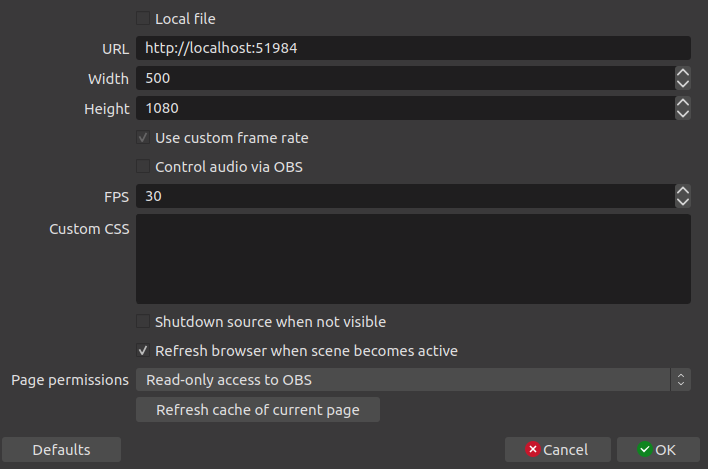
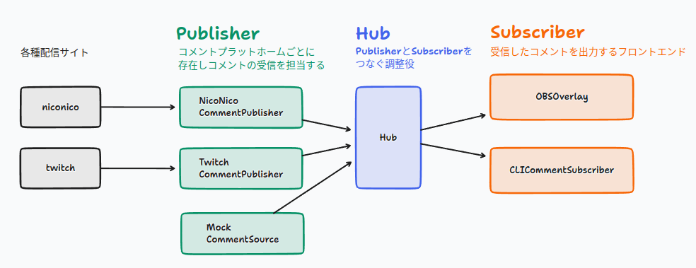

# Simple Comment Viewer

[English](doc/README.en.png)

複数の動画配信プラットホームに対応したコメントビュワー・ジェネレータ

対応プラットホーム: Twitch, ニコニコ生放送

## 特徴

- 複数の動画配信プラットホームでのコメントを一つのタイムラインに統合して表示
- OBSへのオーバーレイ (コメントジェネレータ)
- 拡張が容易な設計

## How to

### 実行

`index.js` の情報を必要に応じて修正し以下を実行

```bash
npm start
```

OBSオーバーレイを利用するには、「ブラウザ」ソースをOBSに追加し、以下のように設定



### ビルド

```shell
npm build
```

### 開発

```shell
npm run start:dev
```

## アーキテクチャ


