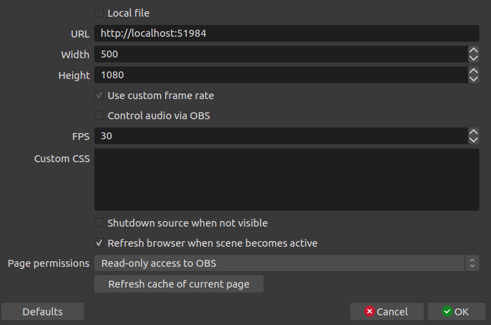

# Simple Comment Viewer

Simple comment viewer for video streamer

Supported platform: Twitch, NicoNico

features

- Multi streaming platform support. You can see comments in multiple platforms in single timeline
- OBS overlay
- Easy to extend

## How to

### Run

Open `index.js` and configure components correctly.

```bash
npm start
```

To enable OBS overlay, add "Browser" source in OBS and configure as follows:



### Build

```shell
npm build
```

### Develop

```shell
npm run start:dev
```

## Architecture


